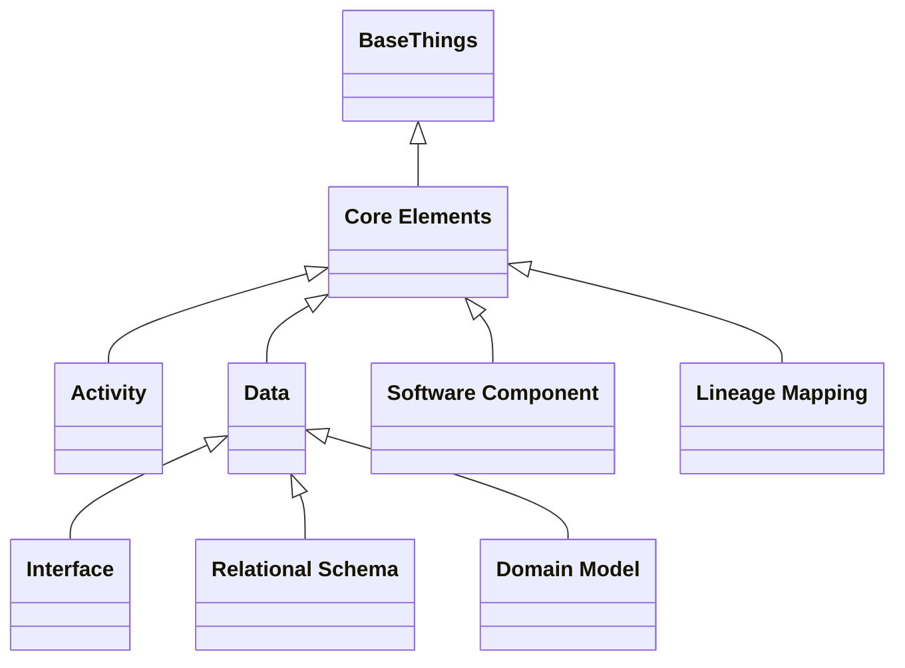
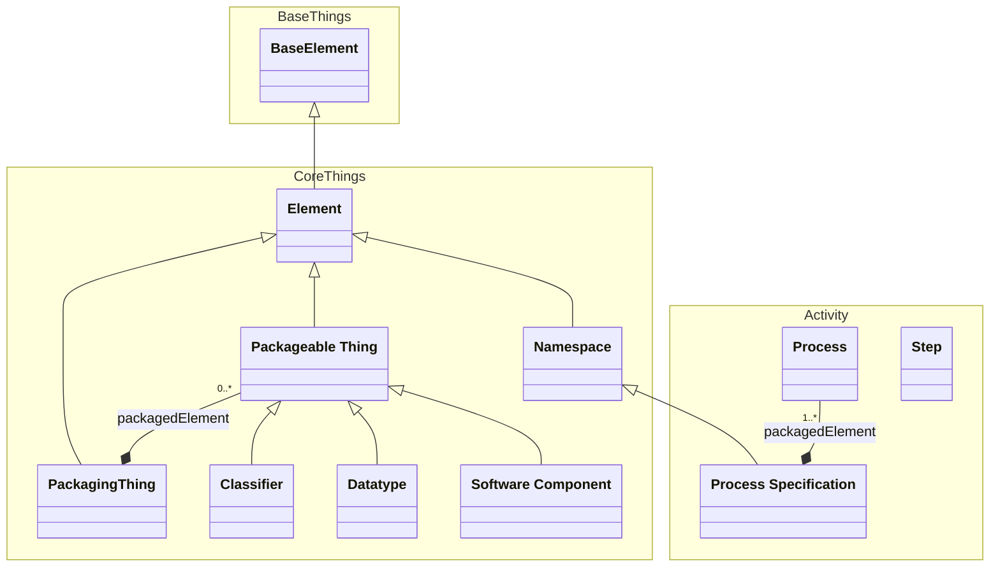

##  Namespace Organization

```mermaid
classDiagram
    direction BT
    class Core ["Core Elements"]
    class SoftwareComponent ["Software Component"]
    class RelationalSchema ["Relational Schema"]
    class LineageMap ["Lineage Mapping"]
    class DomainModel ["Domain Model"]

    Core --|> BaseThings
    Activity --|> Core
    Data --|> Core
    SoftwareComponent --|> Core
    Interface --|> Data
    RelationalSchema --|> Data
    LineageMap --|> Core
    DomainModel --|> Data 
```
##  Class Extensions

```mermaid
classDiagram
    direction BT
    namespace BaseThings {
        class BaseElement
    }
namespace CoreThings {
    class Element
    class Namespace
    class PackageableThing ["Packageable Thing"]
    class PackagingThing
    class Classifier
    class Datatype
    class SoftwareComponent ["Software Component"]
}
    Element --|> BaseElement
    Namespace --|> Element
namespace Activity {
    class ProcessSpecification ["Process Specification"]
    class Process
    class Step
}
    ProcessSpecification --|> Namespace
    ProcessSpecification *-- "1..*" Process : packagedElement
    PackagingThing --|> Element
    PackageableThing--|> Element
    Classifier --|> PackageableThing
    Datatype --|> PackageableThing
    SoftwareComponent --|> PackageableThing
    PackagingThing *-- "0..*" PackageableThing : packagedElement
```

