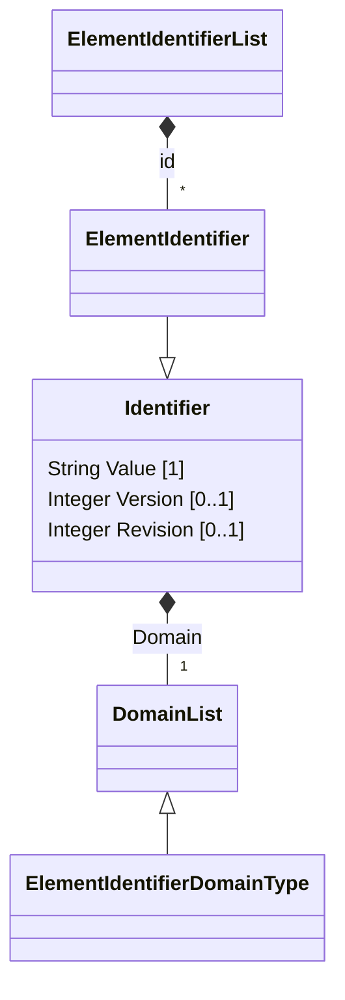

#   Element Identification

A significant decision when designing any data management solution is what to use as the "_Public Universally Unique Identifier_" for any given Business Entity and th best approach depends on the requirements for the UUID itself.

For example, does the identifier need to be...

- **Locally or Globally Unique** within the set of Business Entities that will be referenced by other Business Entities
- **Reproducible** i.e. if we create the same Element twice in the same processing environment then do we produce he same Identifier Value each time? Reproducibility is an important characteristic in many application recovery use cases where a previously submitted transaction may or may not be completed.
- **Algorithmically Derivable** i.e. can we calculate the value of the identifier from the data recorded against the Business Entity independently from the application managing that Business Entity. Sometimes an application needs to be able to calculate the Identifier Value prior to actually creating an instance of the Business Entity. In particular Secondary Identifiers created by an Authoritative Data Store should general;ly be derivable from the System Of Record Identifier Value itself.
- **Predictable** i.e. given the value of one Identifier Value do we need to predict what the value of the next instance of that Identifier would be? This is important in Identifiers, such as invoice numbers, where the issued Identifier needs to form a sequential series of values
- **Persistent** i.e. does the Identifier need to be stable over time?
- ... and many other possible criteria

Answering these questions and implementing a suitable Identifier is relatively easy in a single centralized processing platform where the application has exclusive control over all the Identifiers that it creates and can provide a comprehensive context for navigating between Identifiable Elements based on that single definitive Identifier.

However, in a distributed processing environment where multiple applications may be mastering different instances of the same object (an Object Instance) and passing around those Object Instances between themselves then the requirement to be able to consistently identify a given Object Instance becomes critical.

Unfortunately, metadata in particular is very difficult to identify consistently simply because there are no agreed standards in this area.
For example the following are just some of the potential sources of a specification that may need to be described and published...

-   Specifications maintained in Authoring Tools where we can't control the creation of any UUID's for any element master in that Authoring Tool - this includes just about any 3rd-party modelling software that all seem to just create "random UUID's" for an element.
- Model-to-Model Model Engineering Processes
- Specifications "harvested" from source code repositories using "named-based identifiers" which are rarely unique across multiple repositories.
- Specifications "harvested" from data management platforms again using name-based identifiers to identify all the objects defined in that DBMS.

Each of these sources will have specific requirements for publishing and updating elements that can be subsequently referenced by other elements abd no single identification mechanism works across all sources.

##  Element Identifier

###  Anatomy of an Identifier

Element Identifiers are based on the general Domain + Value pattern used in many business applications as per the following diagram...



Where...

- The Element Idenrifier is itself a list of Identifiers because each Element can be idenrified by multiple different Identifiers depending on the System of REcord for that Element and how many different Authoritative Data Stores it may be registered in.
- Each SOR or ADS has a fixed domain registered in the MetadataElementIdentifierDomainType to identify whoh applications are allowed to create and publish an Identifier
- As per the general principles for a Business Entity Identifier all Element Identifiers are considered equal so any registered Element IOdentifier can  be used to reference any Element providing that the Element Identifier is resolvable by the ADS.

The Element Identifier is published as part of the Common datatypes Specification so that datatypes can be reused by consumers of JMOF to create references to an Element without having to incorporate the entire Meta-Model specification into a consuming application.

###  Element Identifier Domain

Easy Element Identifier cobtaoins a domain that indicates the publisher that issued that partiular Indentifier Value and the allowed domains are egiostered in the Element Identifier Domain List

Like all other Business Entity Identifiers the management of the Domain List is critical to establishing the usability of an Identifier and all Domains must be registered and resolvable in order tio be usable.

1. Any source repository acting as an SOR should have a Globally Unique Domain to identify that repository
    - This assumption requires Domain Registration to be up and running in order to ensure it is true
    - We then reject any domain that is not registered in the Domain List
      -The identifir within that domain is actually unique
        - We can only take this on good faith, especially when a 3rd-party vendor is involved, but very bad things happen when referential integrity within the producer repository is not enforced.
2. All Elements within a single Specification **should all be in the same domain**.
    - This is a *should* rather than a *must* it's not always clear whether all authoring tools keep all elements inported from other authoring tools neat;y partitioned.
    - For example, If importing an LDM from MagicDraw into Erwin and then using Erwin to create a PDM from that LDM then the Erwin repositopry should be able to identify which were the imported elements and which ones it had mastered itself. However, if I recall correctly, Erwin keeps all irt's moedls in a single file withut sub-partitioning so the distinction can be lost.
    - However we can certainly start with **should all be in the same domain** as a start-point (and raise validation warnings if this is not true) and see what happens.

###  Frequently Asked Questions

####    What is the Scope of a Domain?

The scope of a domain is whatever we decide it is but generally it should be the identifier for each specific source that can assign identifiers of whatever sort to elements that will eventually be in scope of the application being developed.

####    Why Multiple Identifiers for the same Element?

This is a general principle ratgher than one specific to a Meta-Model (or Metadata Management) but in a distributed processing environment the same element may be replicated and/or cached in multiple repositories and each pf those repositpories may have their own restrictions on how identifiees are allocated and what values are allowed.

This is not about "**cannot rely on**" a givenm identifier and more a case of "**should not rely on**" the existence of 3rd-party repositories to provide us with persistent identifiers. Remember "_Your Data will ALWAYS outlive your application_" and I think that is particularly pertinent when it comes to applications that are paid for. Sooner or later a cheaper or better alternative comes along.

####    Why are all Identifiers public

This is a matter of past experience where all application identifiers that were inended to be internal and private eventually leak out into the wider eco-system and become public identifiers i.e. used by external application to identify something. So it's simpler to just accept this from the start.

Also, in any successful application it is very likely to be future requirements where an ADS becaomes the SOR for some piece of data (e.g. the original SOR gets decommissioned) and what was an ADS Identifier becomes the SOR Identifier that every one else should use.

##  Referencing an Element

Ideally any reference to any Element should use the SOR Element Identifier for that Element and every repository that stores that Element should be able to resolve any reference to it. This avoids unnecessary peer-to-peer application dependencies on any Identifier other than the SOR Identifier.
It's not bad practice to use alternative identifiers but defintely discouraged and should only be done if absolutely necessary.

However, in the case where the publisher of amn element referencing another element is unsure which Identifier will be recognised by the consumer then all Identifiers know to the publisher should be included in the identifier list . THe consumer can then match on the first valid Identifier and avoid having to resolve Element Identifiers via some intermediary in order to locate the actual Element being referenced.

So, to provide he widest and most flexible support the following prionciples should apply...

-   All Elements imported into any modelling tool **should persist** the SOR Identifier **in addition to** any identifier that it might create for its own internal use.
- If the modelling tool **cannot persist** the SOR Identifier due to some technical limitations then a mapping between the local identifier and the SOR Identifier most be registered in the SOR registry so that other consumers can find it.
- If the modelling tool **can persist** an additional Element Identifier then the repository **should** provide a service to retrieve that Element via the SOR Identifier (and any others that might be registered)
- Any Internal Identifier assigned to an imported Element should be consistent over time i.e. once an Internal Identifier is assigned then it should be considered immutable. Any subsequent updates to that imported Element should be applied to the originally imported Element rather than a neww Element with a new Element Identifier being created.


##  Principles of Identification

### Principles for System of Record or Authoritative Data Store

1. There is aexactly one Systyem or Record for any given Element i.e. no Multi-Master Authoring allowed.
2. there may be any number of ADS's for information copied from an SOR and each could allocate its own internal Identifier to that Element.
3. An ADS may enrich data or derive new data from the replicated SOR data but may not modify the original data.
4. The SOR is always considered to be valid and the definitive statement of truth regarding any given Business Entity that it manages. Hence any published from the SOR that conforms to the Business Entity specification must be considered to be valid.
5. Any Identifier published by an ADS must be resolvable back to the equivalent Element in the SOR.
6. Al data is pubic data so any information published on a boundary (which includes any service interface or information flow) must by definition being public information in order for it to be copied into the ADS and made accessible to other consumers. It's the responsibility of Entitlements to decide whether information is accessible;e by a particular consumer.

### Principles for Element Identifiers

All Identifiers are...

1.  Equally valid - given the principle of Resolvable References then all identifiers should be considered equally valid as references to some Identifiable Element.
2. Any Identifier issued by the SOR is definitive and will always be usable to identify that Element whilst it exists in that domain whilst any data exists that references it.
3. Stable over time so any initially assigned Identifier will be the Identifier for that Element for as long as the Element exists.
4. Predictable i.e. all Identifiers are **Synthetic Identifiers** whose values are will always be reproducible and idempotent i.e. the same input will will construct the same Identifier value using some know algorithm based on information that is always known about the Element being managed.

##  Fully Qualified Name Syntax

Fully Qualified Name is a common concept across many domains and programming languages and many text-based languages require a fully qualified name to be used as an identifier both for a given namespace and for any objects that exist within that namespace.

However, like most of these things, there is no agreed standard to how Fully Qualified Names are constructed nor what tokens parts should be used to construct the FQN.

In many cases what construction rules do exist are for particular sets of languages e.g. Java has an syntax for reference Package and Object names that us pretty m,uch followed by all other languages that run in the JVM.
Similarly SQL imposes a syntax for qualified names used to reference database objects within a Database Schema.

### Principles of a Fully Qualified Name

1. Fully Qualified Name is *not* case-sensitive even if her specifying language is case sensitive.
2. Component parts with a Fully Qualified Name will follow the Naming Guidelines (ToDo: ref to Naming Guidelines) with hyphen instead of whitespace
3. A Fully Qualified Name must be unique within the context or usage of that FQN
4. Many naming conventions stringly recommend the use of a "Class Word" and a "Subject Word" for all Data Elements. In the case of an Identifier the class word is "identifier" and followed by one or more modifiers that describe the subject of the identifier.
5. A Fully Qualified Name is not a universal identifier although in some limited cases can be used as one. It's purpose is to name some within the context of some namespace which may or may not translate into something that uniquely exists with the wider universe. Let's not confuse or conflate the two purposes.

### Uses of Fully Qualified Names

A Fully Qualified Name is a common concept used in m,any places to reference or identify some part of a Specification.

To address each of these purposes the FQN Grammar defines a number of distinct but similar syntactic constructs.

####    Namespace Fully Qualified Name

####    Element Fully Qualified Name

Unique Element Name within Specification Fully Qualified Name.

#### Domain Fully Qualified Name

A Domain value that has been declared in a Domain List for some Identifier. These must be unique within the Domain List (which provides the context) but not necessarily unique across all Domain Lists.

Because this is identifying the publisher of some identifier value the suggested format is...

```
    Publishers Company Domain
    +  Root Class Word
    + 
```

For example...
myDomain/party/individual


####    Relative Fully Qualified Name

####    FQN Aliases


